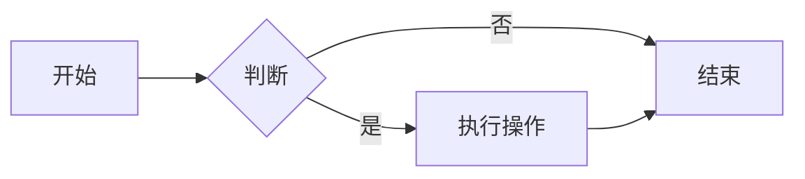
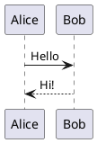

# 文章写作指南

Firefly 博客使用 Astro Content Collections 管理文章内容，支持 Markdown 和 MDX 两种格式。本文档将详细介绍如何创建和编写博客文章，包括 Frontmatter 配置、Markdown 语法扩展、特殊功能等。

## 快速开始

### 创建新文章

项目提供了命令行工具快速创建新文章：

```bash
pnpm new-post <文件名>
```

例如：
```bash
pnpm new-post my-first-post
# 会创建 src/content/posts/my-first-post.md
```

也可以在子目录下创建：
```bash
pnpm new-post blog/tech-tutorial
# 会创建 src/content/posts/blog/tech-tutorial.md
```

新文章会自动生成基础的 Frontmatter 模板，脚本位于 `new-post.js`。

### 手动创建文章

你也可以手动在 `src/content/posts/` 目录下创建 `.md` 或 `.mdx` 文件。建议为每篇文章创建单独的文件夹来组织相关资源：

```
src/content/posts/
├── my-post/
│   ├── index.md      # 文章主文件
│   └── cover.webp    # 文章封面
└── another-post.md   # 单文件形式
```

## Frontmatter 配置

每篇文章开头需要包含 YAML 格式的 Frontmatter，用两个 `---` 包裹。Frontmatter 定义了文章的元数据。

### 完整字段说明

以下是文章 Frontmatter 支持的所有字段：

```yaml
---
# 必填字段
title: "文章标题"                    # 文章标题
published: 2024-01-15              # 发布日期（YYYY-MM-DD 格式）

# 推荐字段
description: "文章简短描述"         # 文章摘要，显示在列表页和 SEO 中
image: "./cover.webp"              # 封面图片路径
tags: [标签1, 标签2]               # 标签数组
category: "分类名称"               # 文章分类

# 可选字段
updated: 2024-01-20                # 更新日期
draft: false                       # 是否为草稿（草稿不会发布）
pinned: false                      # 是否置顶
author: "作者名"                    # 文章作者
lang: "zh-CN"                      # 文章语言
comment: true                      # 是否启用评论

# SEO 和版权
licenseName: "CC BY-NC-SA 4.0"    # 版权协议名称
licenseUrl: "https://..."          # 版权协议链接
sourceLink: "https://..."          # 原文链接（转载文章）

# 高级功能
alias: "custom-url-slug"           # 自定义 URL 别名
order: 0                           # 排序权重（数值越大越靠前）
encrypted: false                   # 是否加密文章
password: "your-password"          # 加密文章密码
passwordHint: "密码提示"           # 密码提示

# 内部使用字段（通常不需要手动设置）
prevTitle: ""
prevSlug: ""
nextTitle: ""
nextSlug: ""
---
```

### 字段详解

#### 必填字段

| 字段 | 类型 | 说明 |
|------|------|------|
| `title` | string | 文章标题，显示在页面和列表中 |
| `published` | date | 发布日期，格式为 `YYYY-MM-DD` |

#### 基础信息字段

| 字段 | 类型 | 默认值 | 说明 |
|------|------|--------|------|
| `description` | string | `""` | 文章摘要，用于列表预览、SEO 和社交分享 |
| `image` | string | `""` | 封面图片，支持多种路径格式（见下文） |
| `tags` | string[] | `[]` | 文章标签数组，用于标签分类和筛选 |
| `category` | string \| null | `""` | 文章分类，同一分类的文章会被归类 |
| `updated` | date | - | 文章更新日期，显示"最后更新"提示 |
| `draft` | boolean | `false` | 设为 `true` 则文章不会在生产构建中显示 |
| `pinned` | boolean | `false` | 设为 `true` 文章会置顶显示 |
| `author` | string | `""` | 文章作者，不填则使用站点默认作者 |
| `lang` | string | `""` | 文章语言代码，如 `zh-CN`、`en`、`ja` |
| `comment` | boolean | `true` | 是否在本文显示评论区 |
| `order` | number | `0` | 排序权重，数值越大在列表中越靠前 |

#### 封面图片路径

`image` 字段支持多种路径格式：

| 格式 | 示例 | 说明 |
|------|------|------|
| 网络图片 | `https://example.com/cover.jpg` | 完整 URL，使用外链图片 |
| public 目录 | `/assets/images/cover.webp` | 以 `/` 开头，相对于 `public/` 目录 |
| 相对路径 | `./cover.webp` | 相对于当前 Markdown 文件 |

::: tip 图片优化建议
- 推荐使用 WebP 或 AVIF 格式以获得更好的压缩率
- 封面图片建议尺寸比例为 16:9 或 3:2
- 将图片放在文章同目录下使用相对路径便于管理
:::

#### 版权字段

| 字段 | 类型 | 说明 |
|------|------|------|
| `licenseName` | string | 版权协议名称，如 "CC BY-NC-SA 4.0" |
| `licenseUrl` | string | 版权协议链接 |
| `sourceLink` | string | 原文链接，用于转载文章标注来源 |

可以在 `licenseConfig.ts` 中配置默认版权信息。

#### URL 别名

使用 `alias` 字段可以自定义文章 URL：

```yaml
---
title: "我的特殊文章"
alias: "my-custom-slug"
---
```

设置后文章可通过 `/posts/my-custom-slug/` 访问。

::: warning 注意事项
- 别名不要包含 `/posts/` 前缀（会自动添加）
- 别名中避免使用特殊字符和空格
- 建议使用小写字母和连字符，利于 SEO
- 确保所有文章别名唯一
- 不要包含前导或尾部斜杠
:::

#### 加密文章

Firefly 支持文章密码保护功能：

```yaml
---
title: "加密文章示例"
encrypted: true
password: "your-password"
passwordHint: "密码提示信息"
---
```

- `encrypted`: 设为 `true` 启用加密
- `password`: 访问密码
- `passwordHint`: 可选，密码提示信息

加密文章在客户端使用 AES 解密，用户输入正确密码后才能查看内容。相关组件：`EncryptedPost.astro`

::: warning 安全提示
客户端加密不能替代服务器端访问控制，敏感内容请勿仅依赖此功能。密码验证在浏览器端进行，不能完全阻止技术手段绕过。
:::

Content Schema 定义在 `content.config.ts` 中，包含完整的类型验证。

## Markdown 基础语法

Firefly 支持标准 Markdown 语法以及 GFM（GitHub Flavored Markdown）扩展。

### 标题

```markdown
# 一级标题
## 二级标题
### 三级标题
#### 四级标题
##### 五级标题
###### 六级标题
```

::: tip 标题最佳实践
- 文章中使用 `##` 作为主要分节标题（`#` 已用于文章标题）
- 不要跳级使用标题（如从 ## 直接跳到 ####）
- 每个标题下应有相应内容
:::

### 文本格式

```markdown
**粗体文本**
*斜体文本*
~~删除线~~
`行内代码`
==高亮文本==（部分主题支持）
```

### 列表

无序列表：
```markdown
- 项目一
- 项目二
  - 嵌套项目
  - 嵌套项目
- 项目三
```

有序列表：
```markdown
1. 第一步
2. 第二步
3. 第三步
```

任务列表：
```markdown
- [x] 已完成任务
- [ ] 待完成任务
- [ ] 计划任务
```

### 链接和图片

```markdown
[链接文本](https://example.com)
[链接文本](https://example.com "链接标题")


```

引用式链接：
```markdown
[链接文本][ref]
[ref]: https://example.com "链接标题"
```

### 引用

```markdown
> 这是一段引用文本
> 可以多行
> > 支持嵌套引用
```

### 代码

行内代码：`` `code` ``

代码块：
````markdown
```javascript
function hello() {
  console.log("Hello, World!");
}
```
````

指定语言可启用语法高亮，支持常见的编程语言。

### 表格

```markdown
| 左对齐 | 居中对齐 | 右对齐 |
|:-------|:--------:|-------:|
| 内容   |   内容   |   内容 |
| 长内容 |  长内容  |  长内容 |
```

### 分割线

```markdown
---
***
___
```

## Markdown 扩展功能

Firefly 内置了多种 Markdown 扩展功能。

### 提醒框（Admonitions/Callouts）

支持多种风格的提醒框，在 `siteConfig.ts` 中配置主题：

```typescript
rehypeCallouts: {
  theme: "github",  // 可选: "github" | "obsidian" | "vitepress"
},
```

::: warning 注意
修改提醒框主题后需要重启开发服务器才能生效。
:::

#### GitHub 主题风格（默认）

```markdown
> [!NOTE]
> 有用的信息，用户应该留意。

> [!TIP]
> 帮助用户更好完成任务的技巧。

> [!IMPORTANT]
> 关键信息，用户必须了解。

> [!WARNING]
> 需要立即注意的关键内容。

> [!CAUTION]
> 操作可能带来的负面后果。
```

#### Obsidian 主题风格

Obsidian 风格支持更多类型：

```markdown
> [!NOTE] 笔记
> 通用笔记内容

> [!INFO] 信息
> 补充信息

> [!TIP] 提示
> 实用技巧

> [!WARNING] 警告
> 警告信息

> [!DANGER] 危险
> 危险操作

> [!SUCCESS] 成功
> 操作成功

> [!FAILURE] 失败
> 操作失败

> [!EXAMPLE] 示例
> 代码示例

> [!QUOTE] 引用
> 引用内容
```

支持自定义标题：
```markdown
> [!TIP] 自定义标题
> 这是一个带有自定义标题的提示框。
```

### GitHub 仓库卡片

可以嵌入 GitHub 仓库信息卡片，自动从 GitHub API 获取数据：

```markdown
::github{repo="CuteLeaf/Firefly"}
```

效果：
::github{repo="CuteLeaf/Firefly"}

### 数学公式（KaTeX）

支持 LaTeX 数学公式，使用 KaTeX 渲染：

行内公式：`$E = mc^2$`

块级公式：
```markdown
$$
\int_{-\infty}^{\infty} e^{-x^2} dx = \sqrt{\pi}
$$
```

支持 mhchem 化学方程式扩展：
```markdown
$$
\ce{2H2 + O2 -> 2H2O}
$$
```

相关配置：`KatexManager.astro`

### Mermaid 图表

支持 Mermaid 绘制流程图、时序图、甘特图等：

````markdown

````

支持的图表类型：
- `graph`/`flowchart`: 流程图
- `sequenceDiagram`: 时序图
- `classDiagram`: 类图
- `stateDiagram`: 状态图
- `gantt`: 甘特图
- `pie`: 饼图
- `erDiagram`: ER图
- `journey`: 用户旅程图

### PlantUML 图表

支持 PlantUML 图表（需要配置 PlantUML 服务）：

````markdown

````

相关配置：`plantumlConfig.ts`

### 代码块增强

基于 Expressive Code，代码块支持多种增强功能：

#### 行号显示

````markdown
```javascript showLineNumbers
function hello() {
  console.log("Hello!");
}
```
````

#### 代码折叠

长代码块可以折叠：
````markdown
```javascript collapse={1-5}
// 这些行会被折叠
function a() {}
function b() {}
function c() {}
function d() {}
function e() {}
// 下面的行显示
console.log("visible");
```
````

#### 行标记

````markdown
```javascript {3,5-7}
function demo() {
  console.log("普通行");
  console.log("标记行"); // {3}
  console.log("范围开始"); // {5}
  console.log("范围中"); // {6}
  console.log("范围结束"); // {7}
}
```
````

#### 语言标识

代码块右上角自动显示语言标识。

相关配置：`expressiveCodeConfig.ts`

### 图片网格

可以创建图片网格布局：

```markdown
:::image-grid


:::
```

### 图片灯箱

文章中的图片默认支持点击放大查看（Fancybox），无需额外配置。

相关组件：`FancyboxManager.astro`

### 目录（TOC）

文章页面侧边栏会自动生成目录，基于文章标题层级。可以在 Frontmatter 中控制（如果有相关配置）。

## MDX 支持

除了 Markdown（.md），Firefly 还支持 MDX（.mdx）格式，可以在 Markdown 中使用 Astro/Svelte/React 等组件。

### 使用 MDX

创建 `.mdx` 文件：

```mdx
---
title: "MDX 示例文章"
published: 2024-01-15
---

import MyComponent from "@components/some/Component.astro";

# 标题

这是一段普通 Markdown 文本。

<MyComponent prop="value" />

更多 Markdown 内容...
```

::: tip 何时使用 MDX
- 需要在文章中嵌入交互式组件
- 需要使用 JSX 语法
- 普通 Markdown 满足不了需求时

大多数情况下，标准 Markdown（.md）已经足够。
:::

## 内容组织

### 文章目录结构

文章存放在 `src/content/posts/` 目录下，可以创建子目录分类组织：

```
src/content/posts/
├── blog/                    # 技术博客分类
│   ├── post-1.md
│   └── post-2.md
├── guide/                   # 指南分类
│   ├── index.md
│   └── cover.webp
├── Firefly-set/            # Firefly 相关
│   └── windows-firefly.md
├── images/                  # 公共图片
│   └── ...
├── code-examples.md
├── markdown-tutorial.md
└── ...
```

子目录不影响文章 URL，URL 由文件路径自动生成。

### 其他内容集合

除了文章（posts），Firefly 还有其他内容集合：

| 集合 | 目录 | 用途 |
|------|------|------|
| `spec` | `src/content/spec/` | 特殊页面（关于、友链等） |
| `moments` | `src/content/moments/` | 动态/说说 |
| `bangumi` | `src/content/bangumi/` | 番剧/影视/书籍/音乐 |
| `changelog` | `src/content/changelog/` | 更新日志 |
| `life` | `src/content/life/` | 生活记录 |

所有集合的 Schema 定义在 `content.config.ts`。

## 写作技巧

### 文章摘要

`description` 字段用于列表页预览和 SEO，如果不填写，系统会自动截取文章开头内容作为摘要。建议手动编写有吸引力的摘要。

```yaml
---
description: "本文将详细介绍如何从零开始搭建一个 Astro 博客，包括环境配置、主题选择、部署上线等全流程。"
---
```

### 标签和分类使用建议

- **标签（Tags）**：描述文章的具体关键词，一篇文章可以有多个标签
  - 例如：`Astro`、`TypeScript`、`性能优化`
- **分类（Category）**：文章的大类别，一篇文章建议只有一个分类
  - 例如：`前端开发`、`技术教程`、`生活随笔`

### 图片处理

1. **图片格式**：优先使用 WebP 或 AVIF 格式，体积更小质量更好
2. **图片尺寸**：不要使用过大的图片，建议宽度不超过 1920px
3. **图片位置**：将图片与文章放在同一目录便于管理
4. **ALT 文本**：始终为图片添加有意义的 alt 文本，利于可访问性和 SEO

```markdown

```

### 文章链接

在文章中链接其他文章时，使用相对路径或绝对路径：

```markdown
[上一篇：环境配置](./prev-post.md)
[部署指南](/posts/deployment-guide/)
```

## 文章预览

### 本地预览

启动开发服务器实时预览文章：

```bash
pnpm dev
```

访问 `http://localhost:4321` 查看效果。

### 草稿文章

设置 `draft: true` 的文章在生产构建中不会显示，但在开发模式下可以预览。

```yaml
---
title: "正在写作的文章"
draft: true
---
```

::: tip 快速切换草稿
写作时设为 `draft: true`，完成后改为 `false` 即可发布。
:::

## 常见问题

### 1. 文章不显示在列表中

**可能原因**：
- `draft: true` 设为草稿
- `published` 日期是未来日期
- Frontmatter 格式错误
- 文件放错目录

**检查清单**：
1. 确认 `draft: false` 或删除该字段
2. 确认发布日期不是未来日期
3. 检查 YAML 语法是否正确（冒号后有空格等）
4. 确认文件在 `src/content/posts/` 目录下

### 2. 封面图片不显示

**检查项**：
- 路径是否正确（相对路径是相对于 Markdown 文件）
- 图片文件是否存在
- 图片格式是否受支持（推荐 WebP/JPG/PNG）

### 3. 代码高亮不工作

- 确保代码块指定了正确的语言标识
- 确认语言标识符拼写正确（如 `javascript` 不是 `js`）

### 4. 数学公式不渲染

- 行内公式使用单个 `$`，块级公式使用 `$$`
- 确保 `$` 符号前后没有空格（行内公式）
- 复杂公式建议使用块级形式

### 5. Mermaid/PlantUML 图表不显示

- 确认代码块语言标识正确（`mermaid` 或 `plantuml`）
- 检查图表语法是否正确
- PlantUML 需要配置正确的服务器地址

## 相关文件链接

| 文件 | 说明 |
|------|------|
| `content.config.ts` | 内容集合 Schema 定义 |
| `new-post.js` | 新建文章脚本 |
| `astro.config.mjs` | Markdown 插件配置 |
| `src/content/posts/` | 文章存放目录 |
| `markdown-tutorial.md` | Markdown 基础教程示例 |
| `markdown-extended.md` | Markdown 扩展功能示例 |
| `EncryptedPost.astro` | 加密文章组件 |
| `licenseConfig.ts` | 默认版权配置 |
| `expressiveCodeConfig.ts` | 代码高亮配置 |
| `plantumlConfig.ts` | PlantUML 配置 |
