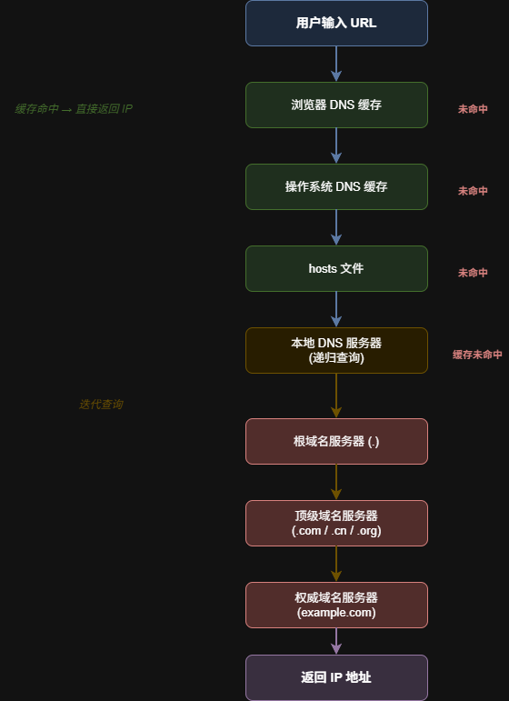
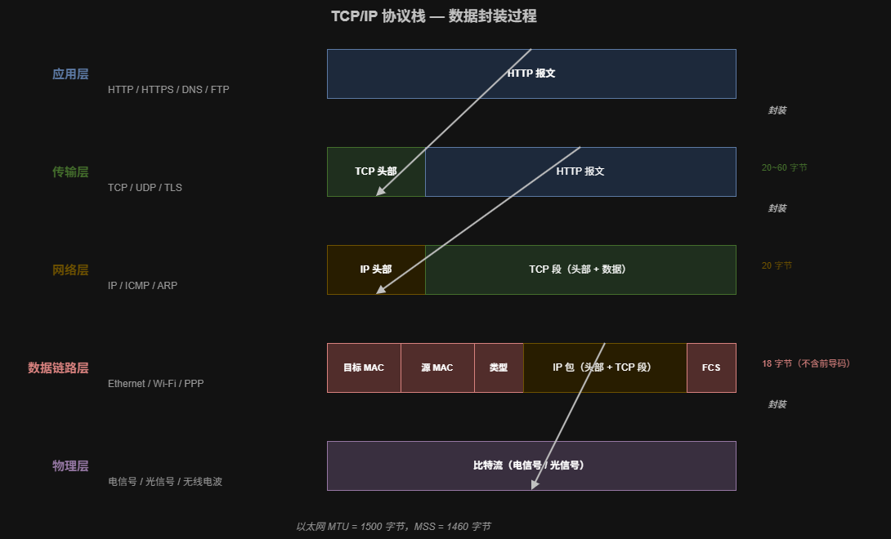
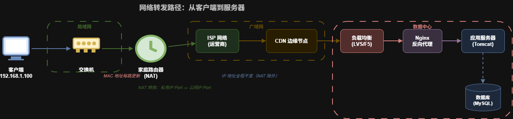
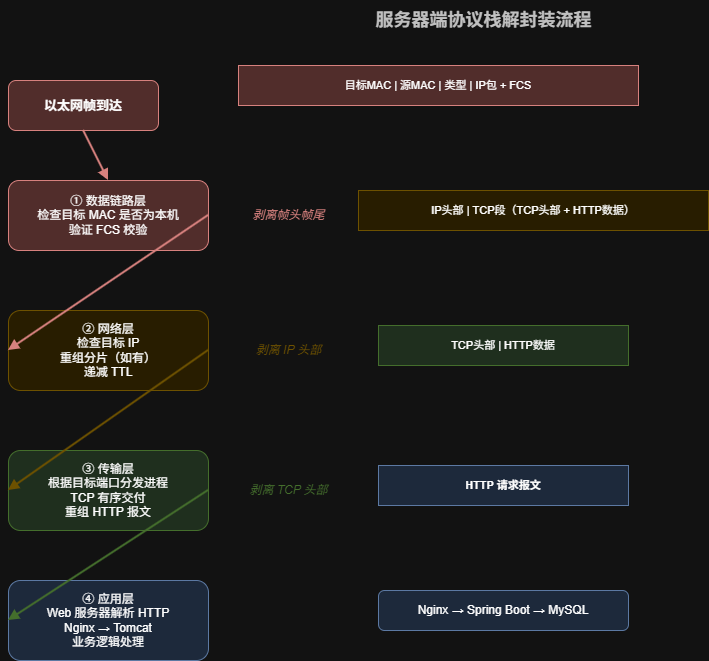
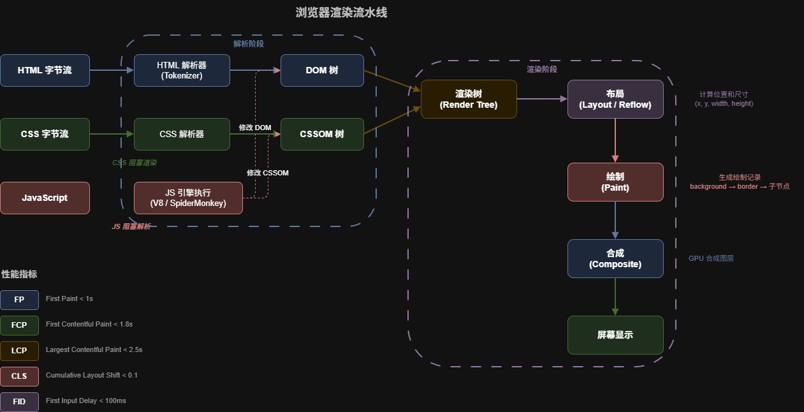
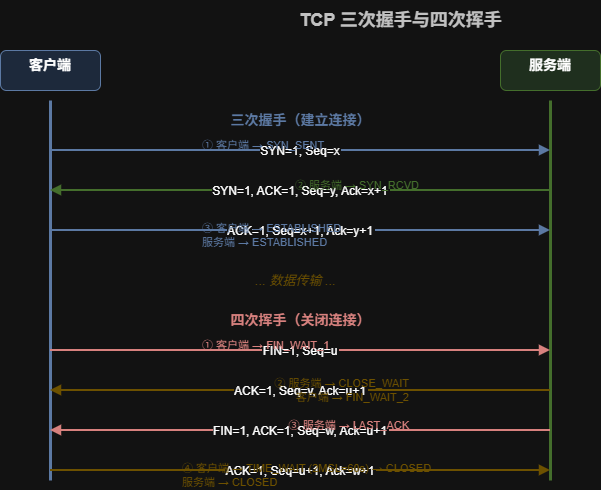

> 本文系统拆解从浏览器输入 URL 到页面完整展示的全链路过程，覆盖应用层到物理层的协议封装、网络转发、服务器处理、响应返回、浏览器渲染 5 个阶段。目标：建立端到端的网络通信心智模型，能完整回答"从 URL 到页面"这道高频面试题。

## 引子

面试中"从输入 URL 到页面展示，中间发生了什么？"这道题，考察范围横跨 DNS、TCP/IP、HTTP、操作系统、浏览器内核等多个领域。能完整回答这道题，说明候选人对 Web 全链路有系统性理解。

本文按照数据包的实际流转路径，逐层拆解每个阶段的技术细节。

## 阶段一：URL 解析与 DNS 域名解析

### 1.1 URL 解析

浏览器接收到用户输入后，首先判断输入内容：

| 输入内容 | 处理方式 |
|---------|---------|
| 含协议头（如 `https://`） | 直接作为 URL 解析 |
| 不含协议头，含 `.`（如 `www.baidu.com`） | 补全 `https://` 前缀 |
| 不含协议头，不含 `.`（如 `search term`） | 作为搜索关键词，跳转默认搜索引擎 |

URL 解析结果提取：协议（scheme）、主机名（host）、端口（port）、路径（path）、查询参数（query）、片段标识（fragment）。

### 1.2 DNS 域名解析

浏览器需要将域名转换为 IP 地址。DNS 解析流程按优先级依次查询：

**第 1 步：浏览器 DNS 缓存**

浏览器维护 DNS 缓存，Chrome 可通过 `chrome://net-internals/#dns` 查看。缓存 TTL 由 DNS 响应中的 TTL 字段决定，通常 60s~3600s。

**第 2 步：操作系统 DNS 缓存**

浏览器缓存未命中时，调用系统 `gethostbyname()` 或 `getaddrinfo()` 接口。操作系统维护本地 DNS 缓存，Windows 可通过 `ipconfig /displaydns` 查看。

**第 3 步：hosts 文件**

操作系统检查 hosts 文件（Windows: `C:\Windows\System32\drivers\etc\hosts`，Linux/Mac: `/etc/hosts`），该文件优先级高于 DNS 服务器。

**第 4 步：本地 DNS 服务器**

操作系统向配置的本地 DNS 服务器（通常由 ISP 分配，或手动配置如 `8.8.8.8`、`114.114.114.114`）发起递归查询。本地 DNS 服务器自身也维护缓存。

**第 5 步：递归 + 迭代查询**

本地 DNS 服务器缓存未命中时，执行完整的 DNS 解析：

1. 向根域名服务器（`.`）查询 → 返回 `.com` 顶级域名服务器地址
2. 向 `.com` 顶级域名服务器查询 → 返回 `example.com` 权威域名服务器地址
3. 向 `example.com` 权威域名服务器查询 → 返回最终 IP 地址

全球共 13 组根域名服务器（A~M），通过任播（Anycast）技术实现全球分布，实际物理节点超过 1000 个。

**DNS 记录类型**：

| 记录类型 | 含义 | 示例 |
|---------|------|------|
| A | 域名 → IPv4 地址 | `example.com → 93.184.216.34` |
| AAAA | 域名 → IPv6 地址 | `example.com → 2606:2800:220:1:...` |
| CNAME | 域名别名 | `www.example.com → example.com` |
| MX | 邮件服务器 | 用于邮件路由 |
| NS | 域名服务器 | 指定该域名的权威 DNS |
| TXT | 文本记录 | SPF、DKIM 等验证 |

DNS 协议默认使用 UDP 端口 53，响应超过 512 字节时切换为 TCP。DNSSEC 场景下强制使用 TCP。

**配图：DNS 解析流程**



### 1.3 ARP 地址解析

获得目标 IP 地址后，操作系统需要确定下一跳的 MAC 地址。如果目标在同一局域网内，ARP 查询目标 IP 对应的 MAC 地址；如果目标在外部网络，ARP 查询默认网关的 MAC 地址。

ARP 流程：
1. 检查本地 ARP 缓存
2. 缓存未命中时，广播 ARP 请求（目标 MAC 为 `FF:FF:FF:FF:FF:FF`）
3. 目标主机收到请求后，单播回复自己的 MAC 地址
4. 发送方将映射关系写入 ARP 缓存

## 阶段二：TCP/IP 协议栈层层封装

数据从应用层向下传递，每一层添加各自的头部信息。这个过程称为封装（Encapsulation）。

**配图：TCP/IP 协议栈封装过程**


### 2.1 应用层：HTTP 请求报文

应用层生成 HTTP 请求报文。以访问 `https://example.com/index.html` 为例：

```http
GET /index.html HTTP/1.1
Host: example.com
User-Agent: Mozilla/5.0 (Windows NT 10.0; Win64; x64) Chrome/120.0
Accept: text/html,application/xhtml+xml,application/xml;q=0.9,*/*;q=0.8
Accept-Language: zh-CN,zh;q=0.9,en;q=0.8
Accept-Encoding: gzip, deflate, br
Connection: keep-alive
Cookie: session_id=abc123
```

HTTP 报文结构：请求行（方法 + URL + 版本）+ 请求头（键值对）+ 空行 + 请求体（GET 请求通常无请求体）。

### 2.2 传输层：TCP 段封装

传输层将 HTTP 报文分割为 TCP 段（Segment），每个段添加 TCP 头部：

| 字段 | 长度 | 说明 |
|------|------|------|
| 源端口 | 16 bit | 浏览器临时端口（49152~65535） |
| 目标端口 | 16 bit | HTTP: 80, HTTPS: 443 |
| 序列号（Seq） | 32 bit | 本报文段数据的第一个字节的序号 |
| 确认号（Ack） | 32 bit | 期望收到的下一个字节的序号 |
| 数据偏移 | 4 bit | TCP 头部长度（以 4 字节为单位） |
| 标志位 | 6 bit | SYN/ACK/FIN/RST/PSH/URG |
| 窗口大小 | 16 bit | 接收窗口大小，用于流量控制 |
| 校验和 | 16 bit | 头部 + 数据的校验 |
| 紧急指针 | 16 bit | URG 标志置位时有效 |

TCP 头部固定 20 字节，可选部分最长 40 字节，因此 TCP 头部范围 20~60 字节。

**MSS 与分段**：TCP 通过 MSS（Maximum Segment Size）控制每个段的最大数据量。以太网 MTU 为 1500 字节，减去 IP 头部 20 字节和 TCP 头部 20 字节，MSS 通常为 1460 字节。

### 2.3 TLS 握手（HTTPS 场景）

使用 HTTPS 时，在 TCP 三次握手之后、HTTP 请求之前，需要完成 TLS 握手。以 TLS 1.3 为例：

1. **Client Hello**：客户端发送支持的加密套件列表、随机数、SNI（Server Name Indication）
2. **Server Hello**：服务端选择加密套件，返回随机数、证书、密钥交换参数
3. **客户端验证证书**：检查证书链、有效期、域名匹配、吊销状态（OCSP/CRL）
4. **密钥交换**：双方基于 ECDHE 算法协商出对称密钥
5. **Finished**：双方发送加密的 Finished 消息，验证握手完整性

TLS 1.3 将握手从 2-RTT 优化为 1-RTT，并支持 0-RTT 恢复（PSK 模式）。

### 2.4 网络层：IP 包封装

网络层将 TCP 段封装为 IP 数据包（Packet），添加 IP 头部：

| 字段 | 长度 | 说明 |
|------|------|------|
| 版本 | 4 bit | IPv4: 4, IPv6: 6 |
| 头部长度 | 4 bit | 以 4 字节为单位，通常为 5（20 字节） |
| 服务类型（TOS） | 8 bit | 区分服务、拥塞通知 |
| 总长度 | 16 bit | 头部 + 数据，最大 65535 字节 |
| 标识 | 16 bit | 用于分片重组 |
| 标志 + 片偏移 | 3 + 13 bit | 分片控制 |
| TTL | 8 bit | 生存时间，每经过一个路由器减 1 |
| 协议 | 8 bit | TCP: 6, UDP: 17, ICMP: 1 |
| 头部校验和 | 16 bit | 仅校验头部 |
| 源 IP | 32 bit | 发送方 IP |
| 目标 IP | 32 bit | 接收方 IP |

**IP 分片**：当 IP 包大小超过链路 MTU 时，路由器会进行分片。分片在目标主机重组。每个分片携带相同的标识字段，通过片偏移确定顺序。

### 2.5 数据链路层：帧封装

数据链路层将 IP 包封装为以太网帧（Frame），添加帧头和帧尾：

```
+----------+----------+----------+----------+----------+
| 前导码    | 目标 MAC | 源 MAC   | 类型     | 数据+FCS |
| 8 字节   | 6 字节   | 6 字节   | 2 字节   | 46~1500  |
+----------+----------+----------+----------+----------+
```

- **前导码（Preamble）**：7 字节交替 10101010 + 1 字节 SFD（10101011），用于时钟同步
- **目标 MAC**：下一跳设备的 MAC 地址（可能是网关而非最终目标）
- **源 MAC**：本机网卡 MAC 地址
- **类型（EtherType）**：标识上层协议，`0x0800` = IPv4，`0x0806` = ARP，`0x86DD` = IPv6
- **FCS（帧校验序列）**：4 字节 CRC 校验，用于检测传输错误

以太网帧有效载荷范围 46~1500 字节。小于 46 字节需要填充，超过 1500 字节需要在 IP 层分片。

### 2.6 物理层：比特流传输

网卡将帧转换为电信号（有线）或无线电信号（无线），通过物理介质传输。每个比特对应一个信号变化：

- 100BASE-TX（百兆以太网）：使用 4B/5B 编码，信号速率 125 Mbaud
- 1000BASE-T（千兆以太网）：使用 PAM-5 编码，信号速率 125 Mbaud × 4 对线
- Wi-Fi 6（802.11ax）：OFDMA + 1024-QAM，最大速率 9.6 Gbps

**配图：数据封装完整流程**



## 阶段三：网络转发与路由

数据包离开本机后，经过多个网络设备转发到达目标服务器。

**配图：网络转发路径**



### 3.1 本地局域网转发

数据包首先到达默认网关（路由器）。转发流程：

1. 主机检查目标 IP 是否在同一子网（通过子网掩码计算）
2. 不在同一子网 → 将帧的目标 MAC 设为默认网关的 MAC 地址
3. 交换机根据 MAC 地址表转发帧到网关对应端口
4. 如果 MAC 地址表中无对应条目，交换机泛洪（Flooding）到所有端口

**交换机工作原理**：
- 学习：从收到的帧中记录源 MAC 与端口的映射
- 转发：根据目标 MAC 查表，转发到对应端口
- 泛洪：目标 MAC 未知时，转发到除源端口外的所有端口
- 过滤：目标 MAC 对应端口与源端口相同时，丢弃帧

### 3.2 路由器转发

路由器工作在网络层，根据路由表决定数据包的下一跳：

1. **解封装**：剥离帧头帧尾，取出 IP 包
2. **查路由表**：根据目标 IP 匹配路由条目（最长前缀匹配）
3. **TTL 递减**：TTL 减 1，若为 0 则丢弃并返回 ICMP Time Exceeded
4. **重新封装**：根据下一跳信息，添加新的帧头帧尾（源/目标 MAC 更新为当前链路的地址）
5. **转发**：从对应接口发送

路由表来源：
| 来源 | 说明 |
|------|------|
| 直连路由 | 路由器接口配置 IP 后自动添加 |
| 静态路由 | 管理员手动配置 |
| 动态路由 | 通过路由协议（OSPF、BGP、RIP）学习 |

**OSPF（开放最短路径优先）**：链路状态协议，用于自治系统（AS）内部。每个路由器维护完整的网络拓扑，通过 Dijkstra 算法计算最短路径。收敛时间通常在秒级。

**BGP（边界网关协议）**：路径向量协议，用于自治系统之间。互联网骨干网的核心路由协议。BGP 路由决策基于 AS-PATH、LOCAL_PREF、MED 等属性，而非单纯最短路径。

### 3.3 NAT 网络地址转换

家庭或企业网络通常使用私有 IP 地址（`10.0.0.0/8`、`172.16.0.0/12`、`192.168.0.0/16`），通过 NAT 将私有 IP 转换为公网 IP。

**NAPT（网络地址端口转换）** 是最常见的 NAT 类型，同时转换 IP 和端口：

```
内网主机 192.168.1.100:50001 → NAT → 公网 203.0.113.1:40001 → 目标服务器
```

NAT 表记录映射关系：`(192.168.1.100, 50001) ↔ (203.0.113.1, 40001)`。NAT 表条目有超时时间（TCP 通常 300s~3600s，UDP 通常 30s~120s）。

NAT 类型：
| 类型 | 行为 | 穿越难度 |
|------|------|---------|
| 完全锥形（Full Cone） | 映射后任何外部主机可访问 | 低 |
| 受限锥形（Restricted Cone） | 仅允许内网主动联系过的外部 IP | 中 |
| 端口受限锥形（Port Restricted Cone） | 限制外部 IP + 端口 | 中高 |
| 对称型（Symmetric） | 每个目标 IP:Port 创建独立映射 | 高 |

### 3.4 CDN 与 DNS 负载均衡

大型网站通常使用 CDN（内容分发网络）加速访问。CDN 通过 DNS 将用户导向最近的边缘节点：

1. 用户查询 `www.example.com` 的 DNS
2. 权威 DNS 返回 CNAME `www.example.com.cdn.example.net`
3. CDN 的智能 DNS 根据用户 IP 的地理位置，返回最近的边缘节点 IP
4. 用户请求到达边缘节点，边缘节点缓存未命中时回源站拉取

DNS 负载均衡策略：轮询、加权轮询、最少连接、IP Hash、地理位置。

## 阶段四：服务器处理与响应

### 4.1 服务器接收数据包

数据包到达目标服务器后，协议栈逐层解封装：

1. **物理层**：网卡将电信号转换为比特流
2. **数据链路层**：检查目标 MAC 是否为本机，验证 FCS 校验
3. **网络层**：检查目标 IP，重组分片（如有）
4. **传输层**：根据目标端口分发到对应进程，TCP 保证有序交付
5. **应用层**：Web 服务器（Nginx/Apache/Tomcat）解析 HTTP 请求

**配图：服务器解封装流程**



### 4.2 Web 服务器处理

**Nginx 反向代理架构**（企业典型部署）：

```
客户端 → CDN → 负载均衡器（LVS/F5）→ Nginx → 应用服务器（Tomcat/Spring Boot）
```

Nginx 处理流程：
1. 接收连接，解析 HTTP 请求
2. 匹配 server 块和 location 块
3. 静态资源：直接从文件系统读取返回
4. 动态请求：通过反向代理转发到后端应用服务器（upstream）

Nginx 采用 Master-Worker 多进程模型，基于 epoll 事件驱动，单机可处理数万并发连接。

### 4.3 应用服务器处理

以 Java Spring Boot 应用为例：

1. **Servlet 容器**（Tomcat）接收请求，创建 HttpServletRequest/Response 对象
2. **Spring DispatcherServlet** 接收请求，查找对应的 Handler（Controller 方法）
3. **拦截器链**：执行 preHandle → Handler 执行 → postHandle → afterCompletion
4. **Controller 处理**：业务逻辑、数据库查询、缓存读写
5. **视图渲染**（REST API 场景直接序列化 JSON）
6. **响应返回**

典型企业级请求处理耗时分布（REST API 场景）：

| 阶段 | 典型耗时 | 占比 |
|------|---------|------|
| 网络传输（客户端 ↔ 服务器） | 20~200ms | 60%~80% |
| 数据库查询 | 5~50ms | 10%~30% |
| 业务逻辑处理 | 1~10ms | 5%~15% |
| 序列化/反序列化 | 1~5ms | 2%~5% |

### 4.4 数据库查询（如有）

应用服务器可能需要查询数据库：

1. 通过连接池（HikariCP/Druid）获取数据库连接
2. ORM 框架（MyBatis/JPA）将方法调用转换为 SQL
3. 数据库执行查询，返回结果集
4. 应用层将结果映射为 Java 对象

## 阶段五：HTTP 响应原路返回

### 5.1 响应报文

服务器生成 HTTP 响应：

```http
HTTP/1.1 200 OK
Content-Type: text/html; charset=UTF-8
Content-Length: 12345
Content-Encoding: gzip
Cache-Control: max-age=3600
Set-Cookie: session_id=abc123; HttpOnly; Secure
Date: Wed, 13 May 2026 08:30:00 GMT
Connection: keep-alive

<!DOCTYPE html>
<html>...
```

状态码分类：
| 范围 | 含义 | 常见状态码 |
|------|------|-----------|
| 1xx | 信息性 | 100 Continue, 101 Switching Protocols |
| 2xx | 成功 | 200 OK, 201 Created, 204 No Content |
| 3xx | 重定向 | 301 永久重定向, 302 临时重定向, 304 Not Modified |
| 4xx | 客户端错误 | 400 Bad Request, 401 Unauthorized, 403 Forbidden, 404 Not Found |
| 5xx | 服务器错误 | 500 Internal Server Error, 502 Bad Gateway, 503 Service Unavailable |

### 5.2 响应数据的封装与返回

响应数据沿反向路径返回：

1. 应用服务器将 HTTP 响应交给操作系统
2. 传输层封装 TCP 段（源端口变为服务器端口，目标端口变为客户端端口）
3. 网络层封装 IP 包（源 IP 为服务器 IP，目标 IP 为客户端 IP）
4. 数据链路层封装帧（源 MAC 为服务器网关 MAC，目标 MAC 为下一跳 MAC）
5. 物理层传输

返回路径与请求路径不一定相同。路由器根据路由表独立决定每一跳的转发路径，请求和响应可能经过不同的中间节点。

### 5.3 浏览器接收响应

浏览器接收到响应后：

1. 检查状态码，处理重定向（3xx）、错误（4xx/5xx）
2. 解析响应头，处理 `Content-Encoding`（解压缩 gzip/br）
3. 检查 `Content-Type` 决定如何处理响应体
4. 根据 `Cache-Control`、`ETag`、`Last-Modified` 决定是否缓存
5. 设置 Cookie（如果响应包含 `Set-Cookie` 头）

## 阶段六：浏览器渲染

### 6.1 渲染流水线概览

浏览器渲染引擎处理 HTML 并显示页面的完整流程：

```
HTML → 解析DOM → CSSOM → 渲染树 → 布局 → 绘制 → 合成 → 显示
```

**配图：浏览器渲染流水线**



### 6.2 解析阶段

**HTML 解析 → DOM 树**

HTML 解析器（Tokenizer）将 HTML 字节流转换为 Token，再构建 DOM 树。解析过程是增量的——不必等待整个 HTML 下载完成才开始解析。

遇到 `<script>` 标签时的行为：
| 标签写法 | 行为 |
|---------|------|
| `<script src="...">` | 阻塞 HTML 解析，下载并执行完成后继续 |
| `<script async src="...">` | 异步下载，下载完成后立即执行，执行时阻塞解析 |
| `<script defer src="...">` | 异步下载，延迟到 DOM 解析完成后按顺序执行 |
| `<script type="module">` | 默认 defer 行为 |

**CSS 解析 → CSSOM**

CSS 解析器将 CSS 规则转换为 CSSOM（CSS Object Model）。CSSOM 构建是渲染阻塞的——浏览器必须等待 CSS 下载并解析完成才能构建渲染树。

CSS 选择器匹配效率（从高到低）：
1. ID 选择器 `#id`
2. 类选择器 `.class`
3. 标签选择器 `div`
4. 相邻兄弟 `div + p`
5. 子选择器 `div > p`
6. 后代选择器 `div p`
7. 通配符 `*`

### 6.3 渲染树（Render Tree）

渲染树是 DOM 树和 CSSOM 树的合并，只包含可见节点：

- `display: none` 的节点不进入渲染树
- `visibility: hidden` 的节点进入渲染树（占位但不可见）
- 伪元素（`::before`、`::after`）进入渲染树

### 6.4 布局（Layout / Reflow）

布局阶段计算每个节点的几何信息：位置（x, y）和尺寸（width, height）。布局是递归的，从根节点开始。

触发回流（Reflow）的操作：
- 添加/删除可见 DOM 元素
- 元素尺寸改变（width、height、padding、border、margin）
- 内容变化（文字、图片尺寸）
- 浏览器窗口大小改变
- 读取布局属性（`offsetWidth`、`offsetHeight`、`clientWidth`、`scrollHeight`）

### 6.5 绘制（Paint）

绘制阶段将渲染树的每个节点转换为屏幕上的像素。浏览器生成绘制记录（Paint Records），描述绘制操作的顺序：背景色 → 背景图 → 边框 → 子节点 → 轮廓。

触发重绘（Repaint）但不触发回流的操作：`color`、`visibility`、`background-color`、`box-shadow` 等。

### 6.6 合成（Compositing）

现代浏览器将页面分为多个图层（Layer），分别绘制后合成：

- `<video>`、`<canvas>`、`CSS 3D transform`、`will-change: transform` 等会创建独立图层
- GPU 负责图层合成，比 CPU 光栅化更快
- 图层数量过多会消耗显存，通常控制在 20 个以内

### 6.7 关键渲染路径指标

| 指标 | 含义 | 优秀阈值 |
|------|------|---------|
| FP（First Paint） | 首次像素绘制 | < 1s |
| FCP（First Contentful Paint） | 首次内容绘制 | < 1.8s |
| LCP（Largest Contentful Paint） | 最大内容绘制 | < 2.5s |
| TTI（Time to Interactive） | 可交互时间 | < 3.8s |
| CLS（Cumulative Layout Shift） | 累积布局偏移 | < 0.1 |
| FID（First Input Delay） | 首次输入延迟 | < 100ms |

## 阶段七：连接关闭

页面资源加载完成后，TCP 连接的关闭遵循四次挥手流程：

**配图：TCP 三次握手与四次挥手**



1. **第一次挥手**：客户端发送 FIN，进入 `FIN_WAIT_1` 状态
2. **第二次挥手**：服务端收到 FIN，回复 ACK，进入 `CLOSE_WAIT` 状态；客户端收到 ACK 后进入 `FIN_WAIT_2` 状态
3. **第三次挥手**：服务端发送自己的 FIN，进入 `LAST_ACK` 状态
4. **第四次挥手**：客户端收到 FIN，回复 ACK，进入 `TIME_WAIT` 状态（等待 2MSL = 60s）后关闭

`TIME_WAIT` 状态持续 2MSL（Maximum Segment Lifetime，通常 30s，共 60s），确保最后的 ACK 能到达服务端，以及旧连接的迟到数据包被丢弃。

HTTP/1.1 默认启用 `Connection: keep-alive`，TCP 连接不会在单次请求后关闭，而是复用处理多个请求。HTTP/2 进一步通过多路复用在单个 TCP 连接上并发处理多个请求。

## 完整流程总结

| 阶段 | 关键操作 | 协议/技术 |
|------|---------|----------|
| 1. URL 解析 | 解析协议、域名、路径 | URL 规范 |
| 2. DNS 解析 | 域名 → IP 地址 | DNS/UDP/TCP:53 |
| 3. TCP 连接 | 三次握手建立连接 | TCP |
| 4. TLS 握手 | 协商加密参数（HTTPS） | TLS 1.2/1.3 |
| 5. 发送请求 | HTTP 请求报文 | HTTP/1.1, HTTP/2, HTTP/3 |
| 6. 协议栈封装 | 逐层添加头部 | TCP → IP → 以太网帧 |
| 7. 网络转发 | 路由、交换、NAT | OSPF, BGP, NAT |
| 8. 服务器处理 | 解封装、业务逻辑、数据库 | Nginx, Tomcat, MySQL |
| 9. 响应返回 | 沿反向路径返回 | 同上 |
| 10. 浏览器渲染 | 解析、布局、绘制、合成 | DOM, CSSOM, GPU |
| 11. 连接关闭 | 四次挥手（或 keep-alive 复用） | TCP |

## 踩坑点 & 注意事项

### DNS 缓存导致的更新延迟

修改 DNS 记录后，全球生效需要等待各级缓存过期。浏览器缓存 TTL 通常由 HTTP 响应的 `Host` 头或 DNS 记录 TTL 决定。企业实践中，切换 DNS 前先将 TTL 降低到 60s，切换完成后再恢复。

### TCP 三次握手的 SYN Flood 攻击

攻击者伪造大量 SYN 包但不完成握手，耗尽服务器的半连接队列。应对方案：SYN Cookie（不分配资源，将状态编码到序列号中）、增大半连接队列、防火墙限速。

### HTTPS 的 SNI 泄露

TLS 握手时的 SNI（Server Name Indication）字段以明文传输，暴露用户访问的域名。解决方案：ECH（Encrypted Client Hello，TLS 1.3 扩展）、DNS over HTTPS（DoH）。

### 浏览器并发连接限制

同一域名下，HTTP/1.1 浏览器限制 6~8 个并发 TCP 连接。优化方案：域名分片（sharding）、HTTP/2 多路复用、使用 CDN。

### 渲染阻塞资源

CSS 和同步 JavaScript 会阻塞渲染。优化方案：CSS 内联关键样式 + 异步加载非关键样式、JavaScript 使用 `defer`/`async`、资源预加载（`<link rel="preload">`）。

## 参考资料

- RFC 791 — Internet Protocol
- RFC 793 — Transmission Control Protocol
- RFC 1035 — Domain Names
- RFC 8446 — The Transport Layer Security (TLS) Protocol Version 1.3
- RFC 7540 — HTTP/2
- Chrome DevTools Network Panel Documentation
- Web.dev — Core Web Vitals

---
> 如果这篇文章对你有帮助，欢迎点赞收藏。有问题欢迎评论区交流。
